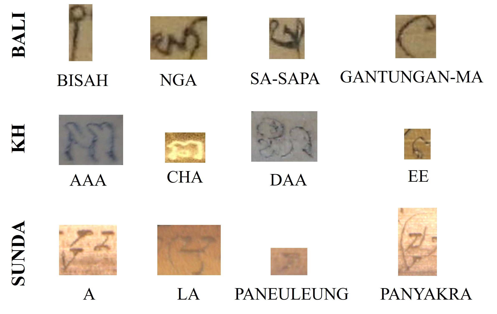

 # 🧠 Isolated Palm Leaf Classification Benchmark 

Welcome to the **Isolated Palm Leaf Classification Benchmark**, a comprehensive framework for evaluating deep learning models on isolated character classification from **palm leaf manuscripts**. This benchmark is focused on **low-resource Southeast Asian scripts** such as **Khmer**, **Balinese**, and **Sundanese**, known for their intricate glyph shapes, stacked diacritics, and limited digital resources.

---
## 🖼️ Visual Example

<p align="center">
  
</p>
<p align="center"><em>Figure 1: Sample isolated glyphs from Khmer, Balinese, and Sundanese  palm leaf manuscripts.</em></p>

---
## 🔍 Overview

Palm leaf manuscripts represent a crucial component of Southeast Asia’s historical archives, preserving ancient texts in traditional scripts. However, these documents are often deteriorated, inconsistently written, and challenging to digitize. This project introduces:

- A **standardized dataset** of isolated glyph images
- **Preprocessing techniques** to enhance input quality
- **Expanded data** through controlled augmentation
- A deep-learning benchmark of **CNN** and **Transformer** architectures

---

## 🎯 Project Goals

- ✅ **Establish a Benchmark**  
  Provide an evaluation suite for isolated glyph classification in low-resource scripts.

- ⚖️ **Compare Architectures**  
  Benchmark classic CNNs and modern transformer-based models on script-specific tasks.

- 📈 **Improve Accuracy**  
  Explore and fine-tune hybrid models for challenging glyph-level classification scenarios.

- 🧼 **Enhance Data Quality**  
  Apply cleaning pipelines and augment the dataset to improve training diversity and generalizability.

---


## 📂 Dataset & Preprocessing

We curated and expanded a high-quality dataset of **isolated glyph images**, categorized across three scripts:

- **Khmer**
- **Balinese**
- **Sundanese**

To improve robustness and generalizability:
- 🧽 **Preprocessing**: We applied noise removal, cropping, normalization, and contrast enhancement.
- 📈 **Augmentation**: We synthetically expanded the dataset using affine transformations, glyph distortion simulations, and grammatical constraints.

Each dataset includes:
- Labeled classes and subcategories
- Training, validation, and test splits
- Binary and grayscale image formats

---

## 🧠 Models

### 1. **VGG**
Simple yet deep CNN architecture using stacked small filters.

### 2. **ResNet**
Introduces residual connections to enable training of very deep networks.

### 3. **Vision Transformer (ViT)**
Applies patch-based self-attention for capturing long-range dependencies.

### 4. **Swin Transformer**
Hierarchical transformer architecture that models both local and global features.

### 5. **Convolutional Vision Transformer (CvT)**
Combines convolution and attention for efficient hybrid modeling.

### 6. **Hybrid CNN + Swin Transformer**
Local features extracted by CNN layers, followed by Swin Transformer blocks to capture global context. Final classification is done using fully connected layers.


## 📊 Evaluation Metrics

| Metric      | Description                                           |
|-------------|-------------------------------------------------------|
| Accuracy    | Proportion of correctly predicted glyph classes       |
| F1 Score    | Harmonic mean of precision and recall                 |

Evaluation scripts include per-class metrics, confusion matrices, and performance plots.

---
📚 Citation
If you use this work, please cite:
```bibtex
@inproceedings{thuon2022improving,
  title     = {Improving Isolated Glyph Classification Task for Palm Leaf Manuscripts},
  author    = {Thuon, Nimol and Du, Jun and Zhang, Jianshu},
  booktitle = {International Conference on Frontiers in Handwriting Recognition (ICFHR)},
  pages     = {65--79},
  year      = {2022},
  organization = {Springer}
}
